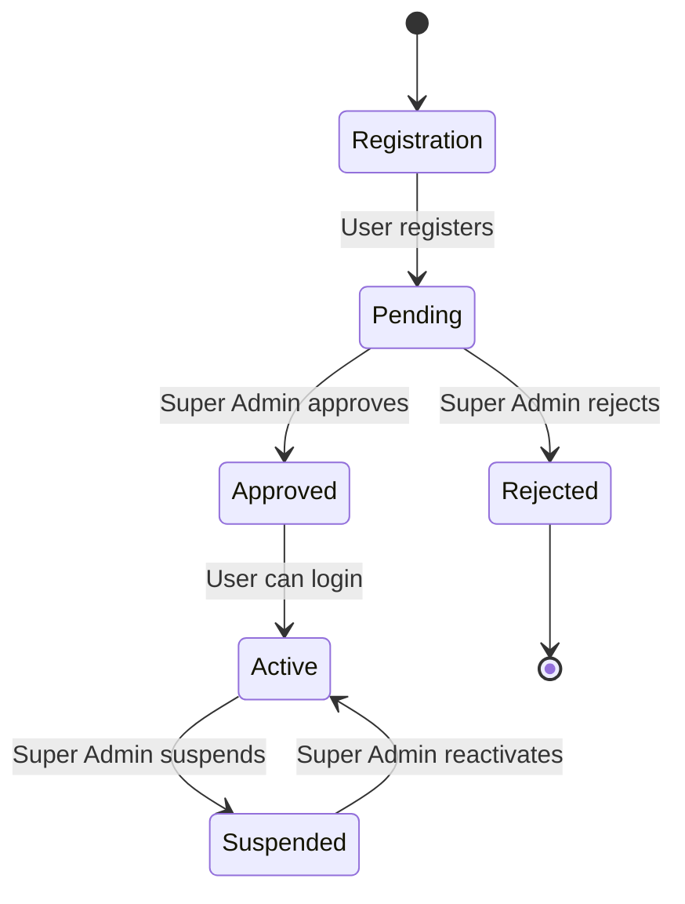

# Super Admin Dashboard Feature Design Plan

## Overview
This plan outlines the integration of a Super Admin role and user approval workflow into the existing Student Disciplinary Record System.

## Current System Analysis

### Database Schema
- **users table**: user_id, password, email, full_name, role (ENUM: 'Admin','Student','Faculty Staff'), department, created_at
- **students table**: student_id, student_number, first_name, last_name, course, year_level, status, contact_number, created_at
- **disciplinary_records, sanctions, violations, audit_logs** tables for incident management

### Authentication System
- JWT-based authentication
- Roles: Admin (full access), Student, Faculty Staff
- Admin can view all users via `/auth/users` endpoint
- Registration creates users directly without approval

### User Types
- Admin: System administration
- Faculty Staff: Incident reporting and student management
- Student: Limited access to own records

## Proposed Changes

### Role Hierarchy
```
Super Admin (highest)
├── Admin
├── Faculty Staff
└── Student (lowest)
```

**Permissions:**
- **Super Admin**: Manage all users, approve/reject registrations, modify roles, system-wide access
- **Admin**: Manage students/faculty, view incidents, audit logs
- **Faculty Staff**: Report incidents, view assigned students
- **Student**: View own disciplinary records

### User Approval Workflow



### Database Schema Changes

1. **Update users.role enum**:
   ```sql
   ALTER TABLE users MODIFY COLUMN role ENUM('Super Admin','Admin','Faculty Staff','Student');
   ```

2. **Add status column**:
   ```sql
   ALTER TABLE users ADD COLUMN status ENUM('pending','approved','rejected','suspended') DEFAULT 'approved';
   ```

3. **Update existing users**:
   - Set default admin to 'Super Admin' and status 'approved'
   - Set other existing users to status 'approved'

### Backend API Changes

#### Modified Endpoints
- **POST /auth/register**: Set status='pending' for non-Super Admin roles
- **POST /auth/login**: Check user.status == 'approved'
- **GET /auth/users**: Include status field, Super Admin only

#### New Endpoints (Super Admin only)
- **GET /auth/pending-users**: List users with status='pending'
- **PUT /auth/approve-user/:id**: Set status='approved'
- **PUT /auth/reject-user/:id**: Set status='rejected'
- **PUT /auth/suspend-user/:id**: Set status='suspended'
- **PUT /auth/update-user-role/:id**: Change user role
- **DELETE /auth/user/:id**: Delete user (with cascade)

#### Middleware Updates
- Add role-based access control middleware
- Verify Super Admin for sensitive operations

### Frontend Changes

#### New Components
- **SuperAdminDashboard**: Main dashboard with user management tabs
- **UserApprovalTable**: Pending users with approve/reject actions
- **UserManagementTable**: All users with role/status management
- **RoleSelector**: Dropdown for role changes

#### Route Protection
```typescript
// Protected route for Super Admin
<Route path="/super-admin" element={
  <ProtectedRoute allowedRoles={['Super Admin']}>
    <SuperAdminDashboard />
  </ProtectedRoute>
} />
```

#### UI Features
- **Dashboard Layout**:
  - Sidebar navigation
  - User statistics cards
  - Pending approvals counter
  - Recent activity log

- **User Management Interface**:
  - Filterable user table
  - Bulk actions for approval/rejection
  - Role assignment dropdowns
  - Status indicators

### Implementation Steps

1. **Database Migration**
   - Update schema in `db.js`
   - Migrate existing data

2. **Backend Implementation**
   - Update auth routes
   - Add new Super Admin endpoints
   - Implement approval workflow logic

3. **Frontend Implementation**
   - Create Super Admin components
   - Update routing and navigation
   - Add user management UI

4. **Testing**
   - Unit tests for new endpoints
   - Integration tests for approval workflow
   - UI testing for dashboard

5. **Security Review**
   - Ensure proper authorization checks
   - Audit logging for Super Admin actions

### Security Considerations

- **Authorization**: Strict role checks on all endpoints
- **Audit Logging**: Log all Super Admin actions
- **Data Validation**: Validate user inputs and role transitions
- **Session Management**: Ensure Super Admin sessions are secure

### Future Enhancements

- Email notifications for approval/rejection
- Bulk user import/export
- Advanced user search and filtering
- Role-based permission matrix
- User activity monitoring

## Conclusion

This design provides a comprehensive Super Admin system with user approval workflow, maintaining backward compatibility while adding enhanced administrative capabilities. The hierarchical role system ensures proper access control, and the approval workflow adds necessary oversight for user management.